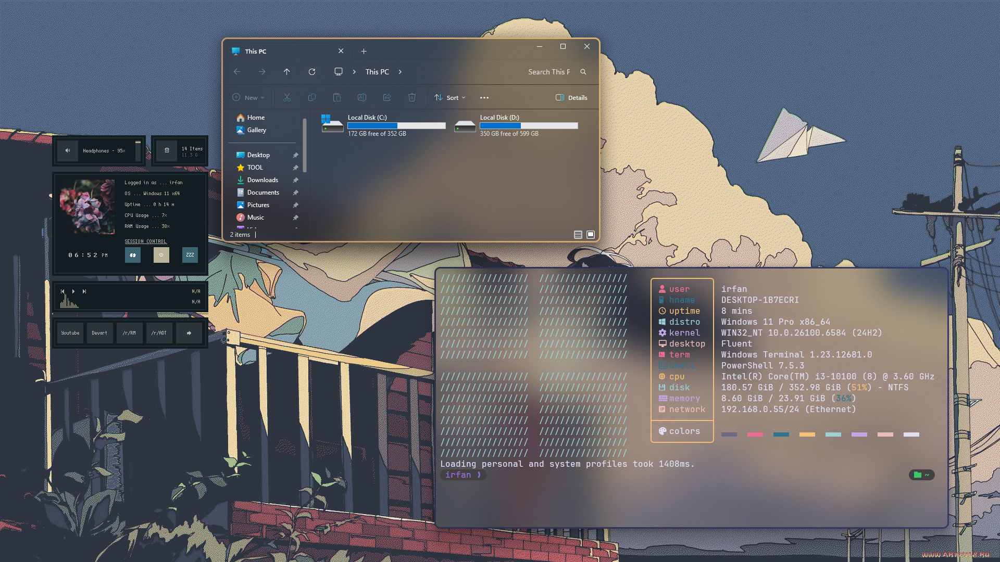

<p align="center">
  
</p>
<p align="center">
  
</p>

# Install

- ```winget install JanDeDobbeleer.OhMyPosh -s winget```
- ```Install-Module posh-git -Scope CurrentUser -Force```
- ```Install-Module -Name Terminal-Icons -Repository PSGallery```
- ```Install-Script winfetch```
- Make A `.config` Directory in Your User Profile Folder
- Open A Ternimal Window In The `.config` Folder And Run The Following ```git clone https://github.com/Frazix12/dotfiles.git .```
- Edit Your $PROFILE By Running `code $PROFILE`
- Put `. $env:USERPROFILE\.config\powershell\user_profile.ps1` In $PROFILE
- Restart Your Terninal And Enjoy ☕.

<p align="center">
  
</p>
